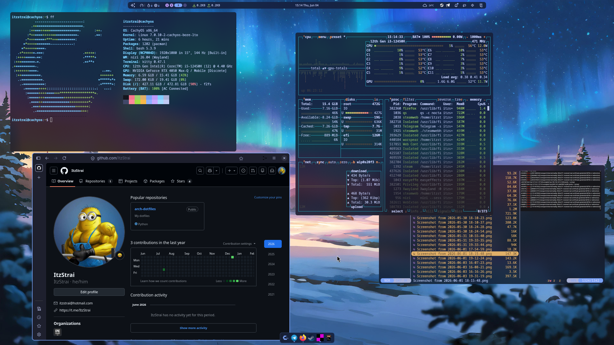

# arch-dotfiles




## Installation

Just use these things. Figure it out yourself.

```bash
cd arch-dotfiles

ln -sf $(pwd)/nvim/.config/nvim ~/.config/nvim
ln -sf $(pwd)/bash/.bashrc ~/.config/
```
voila!
