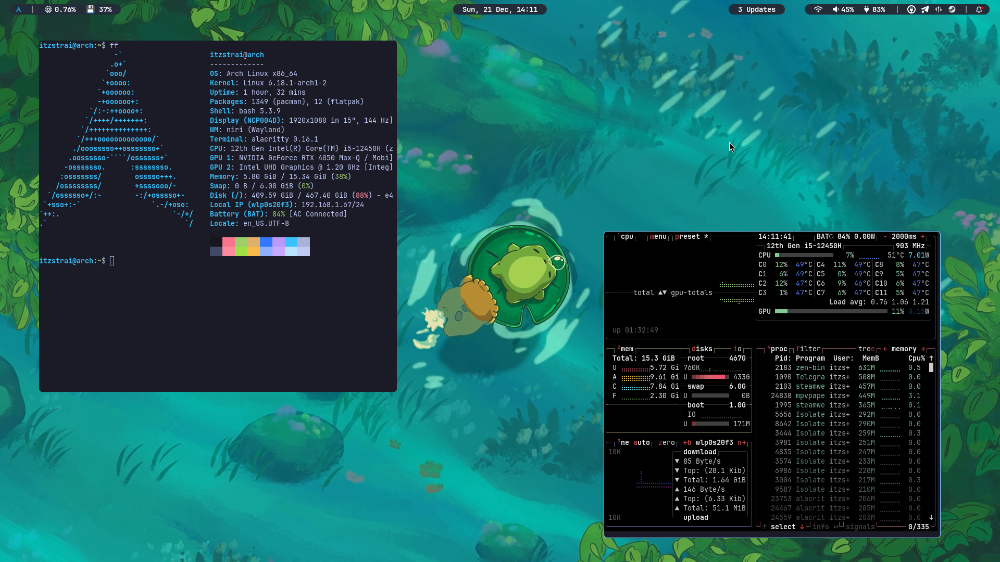

# Arch-dotfiles



## Installation

Personal files are organized through **GNU Stow**.
Because of that:
```bash
yay -S stow
```

And setup:
```bash
cd ~/.dotfiles

stow -R -t ~ *
```

Or just some packages:
```bash
cd ~/.dotfiles

stow -R -t ~ niri waybar nvim 
```

voila!

